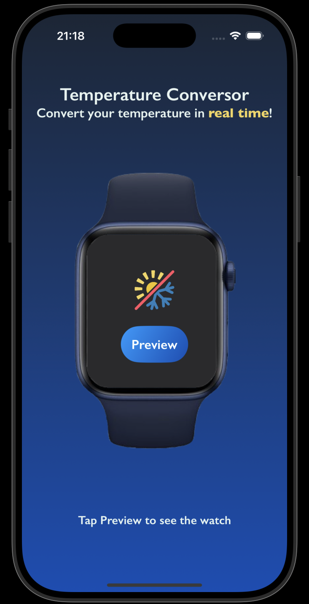
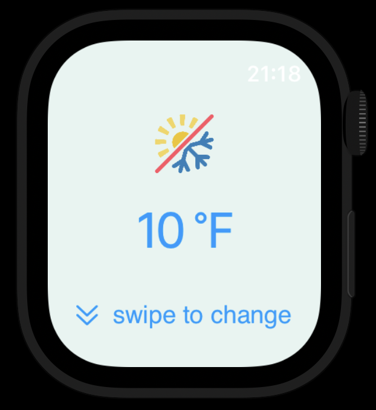

# Temperature Converter

A native iOS application developed in SwiftUI that converts temperatures in real-time using weather data from your current location.

## Screenshots

### Main Interface (iPhone)


### Apple Watch


## Project Structure

```
TemperatureConversor/
├── TemperatureConversor/              # Main iOS app
│   ├── TemperatureConversorApp.swift  # App entry point
│   └── ContentView.swift              # Main interface
├── TemperatureConversorWatchApp/      # Apple Watch app
│   ├── TemperatureConversorWatchAppApp.swift
│   └── ContentView.swift
└── Shared/                            # Shared code
    ├── ContentViewModel.swift         # Business logic
    ├── WatchPreviewView.swift         # Apple Watch preview
    ├── WatchUnitSelectionView.swift   # Unit selection
    ├── LocationManager.swift          # Location management
    ├── Services/
    │   └── WeatherService.swift       # Weather data service
    ├── Models/
    │   └── WeatherModels.swift        # Data models
    └── Assets.xcassets/               # Visual assets
```

## How to Run

### Prerequisites

- Xcode 14.0 or higher
- iOS 15.0 or higher
- Apple Watch (optional, for testing the watchOS version)

### Installation

1. Clone the repository:
```bash
git clone git@github.com:j-peace/TemperatureConversor.git
cd TemperatureConversor
```

2. Open the project in Xcode:
```bash
open TemperatureConversor.xcodeproj
```

3. Select the target device (iPhone or Apple Watch)

4. Run the project (⌘+R)

## Configuration

### Required Permissions

The app requires the following permissions in `Info.plist`:

```xml
<key>NSLocationWhenInUseUsageDescription</key>
<string>This app needs your location to obtain accurate weather data.</string>
```

### APIs Used

- **Open-Meteo**: `https://api.open-meteo.com/v1/forecast`
- **Conversion API**: `https://api-crimson-river-7025.fly.dev`

## Data Flow

1. **Location**: App obtains user's GPS coordinates
2. **Weather Data**: Queries Open-Meteo API for current temperature
3. **Conversion**: Sends temperature in Celsius to conversion API
4. **Display**: Shows converted result in the interface

---
